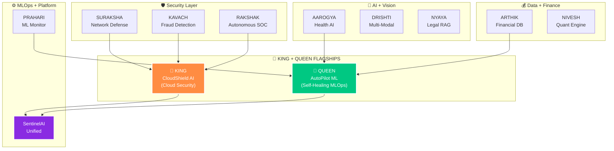

<!-- ═══════════════════════════════════════════════════════════════════
     RAINBOW GRADIENT BANNER — Capsule Render
═══════════════════════════════════════════════════════════════════ -->

<p align="center">
  
</p>

<div align="center">

> *"While others copy tutorials — I build ecosystems."*

[](https://git.io/typing-svg)

<br/>


</div>

---

## ⚡ WHO AM I

<table>
<tr><td>🪪 &nbsp;<b><font size="4">name</font></b></td><td><b><font size="4">J. Dharun Vishnu</font></b></td></tr>
<tr><td>🎓 &nbsp;<b><font size="4">degree</font></b></td><td><b><font size="4">BSc Information Technology (2023 – 2026)</font></b></td></tr>
<tr><td>🛤️ &nbsp;<b><font size="4">track</font></b></td><td><b><font size="4">AI/ML Engineer → Cloud Engineer → Cybersecurity Engineer</font></b></td></tr>
<tr><td>📍 &nbsp;<b><font size="4">location</font></b></td><td><b><font size="4">India 🇮🇳</font></b></td></tr>
<tr><td>🎯 &nbsp;<b><font size="4">mission</font></b></td><td><b><font size="4">Build AI systems that protect India's digital infrastructure</font></b></td></tr>
<tr><td>🗺️ &nbsp;<b><font size="4">roadmap</font></b></td><td><b><font size="4">8 Coursera Courses · 12 Layers · 610 Steps · 3 AWS Certifications · 20 Projects</font></b></td></tr>
<tr><td>⚡ &nbsp;<b><font size="4">currently</font></b></td><td><b><font size="4">Layer 1 — Python + Streamlit + FastAPI + GitHub Actions</font></b></td></tr>
<tr><td>👑 &nbsp;<b><font size="4">flagships</font></b></td><td><b><font size="4">CloudShield AI (KING) + AutoPilot ML (QUEEN) — grow with every layer</font></b></td></tr>
<tr><td>🏆 &nbsp;<b><font size="4">target 2027</font></b></td><td><b><font size="4">Production AI + Cloud + Cybersecurity deployment</font></b></td></tr>
</table>

> **<font size="4">I'm not following a bootcamp. I'm executing a 610-step engineering roadmap — building 20 production-grade AI + security projects from scratch before I graduate.</font>**
>
> **<font size="4">Every project that has a v2 is a living project — it starts simple and upgrades automatically as each new layer (SQL → ML → DL → GenAI → AWS → MLOps) is completed. One codebase. Growing smarter with every layer.</font>**

---

# 🗺️ THE PLAN — 8 Coursera Courses · 12 Layers · 610 Steps · 20 Projects · 3 AWS Certifications

<table>
<tr><th width="12%">Layer</th><th width="16%">Steps</th><th width="54%">Course</th><th width="18%">Status</th></tr>

<tr>
  <td align="center">🔵 &nbsp;<b><font size="4">Layer 1</font></b></td>
  <td align="center"><b><font size="4">Step 1 – 85</font></b></td>
  <td>
    <b><font size="6">🐍 PYTHON FOR EVERYBODY</font></b><br/>
    <b><font size="4">University of Michigan · Python Programming · OOP · Git · GitHub · Streamlit · pytest</font></b>
  </td>
  <td align="center"><b><font size="4">📋 Planned</font></b></td>
</tr>

<tr>
  <td align="center">🟠 &nbsp;<b><font size="4">Layer 2</font></b></td>
  <td align="center"><b><font size="4">Step 86 – 140</font></b></td>
  <td>
    <b><font size="6">🔶 DSA SPECIALIZATION</font></b><br/>
    <b><font size="4">UC San Diego · Data Structures & Algorithms · LeetCode · NetworkX · Docker</font></b>
  </td>
  <td align="center"><b><font size="4">📋 Planned</font></b></td>
</tr>

<tr>
  <td align="center">🟡 &nbsp;<b><font size="4">Layer 3</font></b></td>
  <td align="center"><b><font size="4">Step 141 – 180</font></b></td>
  <td>
    <b><font size="6">🗄️ SQL FOR DATA SCIENCE</font></b><br/>
    <b><font size="4">UC Davis · PostgreSQL · SQLAlchemy · Alembic · Window Functions</font></b>
  </td>
  <td align="center"><b><font size="4">📋 Planned</font></b></td>
</tr>

<tr>
  <td align="center">🟢 &nbsp;<b><font size="4">Layer 4+5</font></b></td>
  <td align="center"><b><font size="4">Step 181 – 250</font></b></td>
  <td>
    <b><font size="6">📐 MATHEMATICS FOR ML</font></b><br/>
    <b><font size="4">DeepLearning.AI · NumPy · PyMC · SciPy · Bayesian Inference</font></b>
  </td>
  <td align="center"><b><font size="4">📋 Planned</font></b></td>
</tr>

<tr>
  <td align="center">🟣 &nbsp;<b><font size="4">Layer 6</font></b></td>
  <td align="center"><b><font size="4">Step 251 – 325</font></b></td>
  <td>
    <b><font size="6">🤖 ML SPECIALIZATION</font></b><br/>
    <b><font size="4">Andrew Ng / DeepLearning.AI · sklearn · XGBoost · SHAP · MLflow · Optuna</font></b>
  </td>
  <td align="center"><b><font size="4">📋 Planned</font></b></td>
</tr>

<tr>
  <td align="center">🩵 &nbsp;<b><font size="4">Layer 7</font></b></td>
  <td align="center"><b><font size="4">Step 326 – 340</font></b></td>
  <td>
    <b><font size="6">☁️ AWS CLOUD PRACTITIONER</font></b><br/>
    <b><font size="4">AWS · FastAPI · Docker · API + Tools + AWS Cloud Practitioner</font></b>
  </td>
  <td align="center"><b><font size="4">📋 Planned</font></b></td>
</tr>

<tr>
  <td align="center">🔴 &nbsp;<b><font size="4">Layer 8</font></b></td>
  <td align="center"><b><font size="4">Step 341 – 420</font></b></td>
  <td>
    <b><font size="6">🧠 DEEP LEARNING SPECIALIZATION</font></b><br/>
    <b><font size="4">Andrew Ng / DeepLearning.AI · PyTorch · EfficientNet · Transformers · ONNX</font></b>
  </td>
  <td align="center"><b><font size="4">📋 Planned</font></b></td>
</tr>

<tr>
  <td align="center">🔷 &nbsp;<b><font size="4">Layer 9+10</font></b></td>
  <td align="center"><b><font size="4">Step 421 – 510</font></b></td>
  <td>
    <b><font size="6">💬 GENAI WITH LLMS</font></b><br/>
    <b><font size="4">DeepLearning.AI + AWS · LangChain · RAG · CrewAI · LangGraph</font></b>
  </td>
  <td align="center"><b><font size="4">📋 Planned</font></b></td>
</tr>

<tr>
  <td align="center">🟩 &nbsp;<b><font size="4">Layer 11</font></b></td>
  <td align="center"><b><font size="4">Step 511 – 590</font></b></td>
  <td>
    <b><font size="6">⚙️ ML ENGINEERING FOR PRODUCTION</font></b><br/>
    <b><font size="4">DeepLearning.AI · MLflow · K8s · ArgoCD · Istio · Terraform</font></b>
  </td>
  <td align="center"><b><font size="4">📋 Planned</font></b></td>
</tr>

<tr>
  <td align="center">🟥 &nbsp;<b><font size="4">Layer 12</font></b></td>
  <td align="center"><b><font size="4">Step 591 – 610</font></b></td>
  <td>
    <b><font size="6">🏆 FINAL POLISH + OSS</font></b><br/>
    <b><font size="4">Final Polish · Open Source · AWS ML Specialty · Job Ready</font></b>
  </td>
  <td align="center"><b><font size="4">📋 Planned</font></b></td>
</tr>

</table>

---

### ☁️ AWS Certifications

<table>
<tr><th width="14%">Layer</th><th width="68%">Certification</th><th width="18%">Status</th></tr>

<tr>
  <td align="center">🟠 &nbsp;<b><font size="4">Layer 7</font></b></td>
  <td><b><font size="5">☁️ AWS CERTIFIED CLOUD PRACTITIONER</font></b></td>
  <td align="center"><b><font size="4">📋 Planned</font></b></td>
</tr>

<tr>
  <td align="center">🔵 &nbsp;<b><font size="4">Layer 11</font></b></td>
  <td><b><font size="5">🏗️ AWS CERTIFIED SOLUTIONS ARCHITECT ASSOCIATE</font></b></td>
  <td align="center"><b><font size="4">📋 Planned</font></b></td>
</tr>

<tr>
  <td align="center">🟣 &nbsp;<b><font size="4">Layer 12</font></b></td>
  <td><b><font size="5">🤖 AWS CERTIFIED ML SPECIALTY</font></b></td>
  <td align="center"><b><font size="4">📋 Planned</font></b></td>
</tr>

</table>

> **<font size="4">🔄 Status updates as certificates are earned: 📋 Planned → 🎯 Earning → ✅ Certified</font>**

---

# 👑 THE FLAGSHIPS — 2 KING-QUEEN PROJECTS

> **<font size="4">Two enterprise-grade projects that grow with every single layer. By Step 610, these will be world-class showcases built from scratch.</font>**

<br/>

# 👑 KING PROJECT — CloudShield AI

### 🛡️ AI-Powered Cloud Security Posture Management (CSPM) Platform

> **<font size="4">AWS infrastructure auto-scanner with LLM-driven Terraform remediation.</font>**

### 📈 Layer-by-Layer Upgrade Journey

<table>
<tr><th>Version</th><th>After Layer</th><th>What's Added</th><th>Skill Proof</th></tr>
<tr><td align="center"><b><font size="4">v1.0</font></b></td><td align="center"><b><font size="4">Layer 1 — Python</font></b></td><td><b><font size="4">CLI tool: mocked AWS JSON scan → Streamlit report</font></b></td><td align="center"><b><font size="4">Python OOP</font></b></td></tr>
<tr><td align="center"><b><font size="4">v1.1</font></b></td><td align="center"><b><font size="4">Layer 2 — DSA</font></b></td><td><b><font size="4">Trie (IAM wildcard parsing) + Graph (lateral movement)</font></b></td><td align="center"><b><font size="4">Data Structures</font></b></td></tr>
<tr><td align="center"><b><font size="4">v1.2</font></b></td><td align="center"><b><font size="4">Layer 3 — SQL</font></b></td><td><b><font size="4">PostgreSQL scan history + Window functions (trends)</font></b></td><td align="center"><b><font size="4">SQL Mastery</font></b></td></tr>
<tr><td align="center"><b><font size="4">v1.3</font></b></td><td align="center"><b><font size="4">Layer 4 — Maths</font></b></td><td><b><font size="4">CVSS Matrix risk scoring (linear algebra from scratch)</font></b></td><td align="center"><b><font size="4">Math Foundation</font></b></td></tr>
<tr><td align="center"><b><font size="4">v1.4</font></b></td><td align="center"><b><font size="4">Layer 5 — ML</font></b></td><td><b><font size="4">Isolation Forest → CloudTrail anomaly detection</font></b></td><td align="center"><b><font size="4">ML Production</font></b></td></tr>
<tr><td align="center"><b><font size="4">v1.5</font></b></td><td align="center"><b><font size="4">Layer 7 — DL</font></b></td><td><b><font size="4">Autoencoder → network traffic zero-day detection</font></b></td><td align="center"><b><font size="4">Deep Learning</font></b></td></tr>
<tr><td align="center"><b><font size="4">v1.6</font></b></td><td align="center"><b><font size="4">Layer 8 — GenAI</font></b></td><td><b><font size="4">LLM Agent (LangChain + RAG) → auto Terraform fix</font></b></td><td align="center"><b><font size="4">Agentic AI</font></b></td></tr>
<tr><td align="center"><b><font size="4">v1.7</font></b></td><td align="center"><b><font size="4">Layer 10 — MLOps</font></b></td><td><b><font size="4">AWS EKS + Helm Chart + PyPI package publish</font></b></td><td align="center"><b><font size="4">Production Scale</font></b></td></tr>
<tr><td align="center"><b><font size="4">v1.8</font></b></td><td align="center"><b><font size="4">Layer 11 — Final</font></b></td><td><b><font size="4">🏆 Enterprise-grade open-source CSPM platform</font></b></td><td align="center"><b><font size="4">Step 610</font></b></td></tr>
</table>

---

# 👑 QUEEN PROJECT — AutoPilot ML

### 🤖 Self-Healing Level-4 MLOps Platform

> **<font size="4">Auto train · evaluate · deploy · monitor · drift detect · retrain · redeploy — zero human intervention.</font>**

### 📈 Layer-by-Layer Upgrade Journey

<table>
<tr><th>Version</th><th>After Layer</th><th>What's Added</th><th>Skill Proof</th></tr>
<tr><td align="center"><b><font size="4">v1.0</font></b></td><td align="center"><b><font size="4">Layer 1 — Python</font></b></td><td><b><font size="4">CSV read + model metrics auto-log</font></b></td><td align="center"><b><font size="4">Python OOP</font></b></td></tr>
<tr><td align="center"><b><font size="4">v1.1</font></b></td><td align="center"><b><font size="4">Layer 2 — DSA</font></b></td><td><b><font size="4">Min-Heap model ranker (latency + accuracy score)</font></b></td><td align="center"><b><font size="4">Data Structures</font></b></td></tr>
<tr><td align="center"><b><font size="4">v1.2</font></b></td><td align="center"><b><font size="4">Layer 3 — SQL</font></b></td><td><b><font size="4">PostgreSQL model registry + hyperparameter history</font></b></td><td align="center"><b><font size="4">SQL Mastery</font></b></td></tr>
<tr><td align="center"><b><font size="4">v1.3</font></b></td><td align="center"><b><font size="4">Layer 4 — Maths</font></b></td><td><b><font size="4">KS Test + PSI drift detection from scratch</font></b></td><td align="center"><b><font size="4">Math Foundation</font></b></td></tr>
<tr><td align="center"><b><font size="4">v1.4</font></b></td><td align="center"><b><font size="4">Layer 5 — ML</font></b></td><td><b><font size="4">Auto hyperparameter optimizer (Optuna-style)</font></b></td><td align="center"><b><font size="4">ML Production</font></b></td></tr>
<tr><td align="center"><b><font size="4">v1.5</font></b></td><td align="center"><b><font size="4">Layer 7 — DL</font></b></td><td><b><font size="4">Knowledge Distillation pipeline (large → small model)</font></b></td><td align="center"><b><font size="4">Deep Learning</font></b></td></tr>
<tr><td align="center"><b><font size="4">v1.6</font></b></td><td align="center"><b><font size="4">Layer 8 — GenAI</font></b></td><td><b><font size="4">LLM MLOps Copilot → drift interpret + auto-trigger</font></b></td><td align="center"><b><font size="4">Agentic AI</font></b></td></tr>
<tr><td align="center"><b><font size="4">v1.7</font></b></td><td align="center"><b><font size="4">Layer 10 — MLOps</font></b></td><td><b><font size="4">MLflow + SageMaker + canary rollout + auto rollback</font></b></td><td align="center"><b><font size="4">Production Scale</font></b></td></tr>
<tr><td align="center"><b><font size="4">v1.8</font></b></td><td align="center"><b><font size="4">Layer 11 — Final</font></b></td><td><b><font size="4">🏆 Level-4 autonomous self-healing ML platform</font></b></td><td align="center"><b><font size="4">Step 610</font></b></td></tr>
</table>

---

### 🔥 The Golden Rule

> **<font size="4">90% effort → 18 ecosystem projects (the foundation)</font>**
> **<font size="4">10% effort → KING + QUEEN flagships (the showcase)</font>**
> **<font size="4">Reuse ecosystem code in flagships. Never rewrite. Same skill — bigger impact.</font>**

---

# 🏗️ THE ECOSYSTEM — 18 LIVING PROJECTS

> **<font size="4">Every project is part of one unified AI + Cybersecurity command centre — SentinelAI India.</font>**
> **<font size="4">None of these are tutorial clones. All connected. All upgraded layer-by-layer.</font>**
>
> **<font size="4">v1 projects = built in the assigned layer · v2 projects = 🔄 living projects that upgrade automatically as each new layer is completed.</font>**

<br/>

<table>
<tr><th width="6%">#</th><th width="58%">Project</th><th width="22%">Layer</th><th width="14%">Status</th></tr>

<tr>
  <td align="center"><b><font size="5">P1</font></b></td>
  <td>
    <b><font size="5">🩺 AAROGYA v1 — INDIA HEALTH ANALYTICS</font></b><br/>
    <sub><b><font size="3">Apollo + AIIMS-style health analytics · Live deployed Streamlit app</font></b></sub>
  </td>
  <td align="center"><b><font size="4">Layer 1</font></b></td>
  <td align="center"><b><font size="4">📋 Planned</font></b></td>
</tr>

<tr>
  <td align="center"><b><font size="5">P2</font></b></td>
  <td>
    <b><font size="5">🩺 AAROGYA v2 — AI HEALTH ASSISTANT</font></b><br/>
    <sub><b><font size="3">PostgreSQL · FastAPI + ML · AWS · K8s — full Python mastery + CI/CD</font></b></sub>
  </td>
  <td align="center"><b><font size="4">Starts Layer 1 · Upgrades till Layer 12</font></b></td>
  <td align="center"><b><font size="4">🔄 Living</font></b></td>
</tr>

<tr>
  <td align="center"><b><font size="5">P3</font></b></td>
  <td>
    <b><font size="5">🛡️ SURAKSHA v1 — NETWORK SECURITY MONITOR</font></b><br/>
    <sub><b><font size="3">BFS + DFS + Dijkstra on corporate attack paths · NetworkX</font></b></sub>
  </td>
  <td align="center"><b><font size="4">Layer 2</font></b></td>
  <td align="center"><b><font size="4">📋 Planned</font></b></td>
</tr>

<tr>
  <td align="center"><b><font size="5">P4</font></b></td>
  <td>
    <b><font size="5">🛡️ SURAKSHA v2 — THREAT INTELLIGENCE PIPELINE</font></b><br/>
    <sub><b><font size="3">Trie + Heap + HashMap + Graph · PostgreSQL · ML · AWS GuardDuty · K8s</font></b></sub>
  </td>
  <td align="center"><b><font size="4">Starts Layer 2 · Upgrades till Layer 12</font></b></td>
  <td align="center"><b><font size="4">🔄 Living</font></b></td>
</tr>

<tr>
  <td align="center"><b><font size="5">P5</font></b></td>
  <td>
    <b><font size="5">💰 ARTHIK v1 — FINANCIAL DATABASE ENGINE</font></b><br/>
    <sub><b><font size="3">UPI / Zomato / Swiggy-style SQL analytics · Window functions · CTEs</font></b></sub>
  </td>
  <td align="center"><b><font size="4">Layer 3</font></b></td>
  <td align="center"><b><font size="4">📋 Planned</font></b></td>
</tr>

<tr>
  <td align="center"><b><font size="5">P6</font></b></td>
  <td>
    <b><font size="5">💰 ARTHIK v2 — PRODUCTION BFSI PLATFORM</font></b><br/>
    <sub><b><font size="3">FastAPI + ML · AWS RDS Multi-AZ · GenAI · K8s + Vault — RBI compliance</font></b></sub>
  </td>
  <td align="center"><b><font size="4">Starts Layer 3 · Upgrades till Layer 12</font></b></td>
  <td align="center"><b><font size="4">🔄 Living</font></b></td>
</tr>

<tr>
  <td align="center"><b><font size="5">P7</font></b></td>
  <td>
    <b><font size="5">📈 NIVESH v1 — QUANTITATIVE FINANCE ENGINE</font></b><br/>
    <sub><b><font size="3">NSE portfolio · Markowitz · PCA from scratch · Pure NumPy mathematics</font></b></sub>
  </td>
  <td align="center"><b><font size="4">Layer 4</font></b></td>
  <td align="center"><b><font size="4">📋 Planned</font></b></td>
</tr>

<tr>
  <td align="center"><b><font size="5">P8</font></b></td>
  <td>
    <b><font size="5">📈 NIVESH v2 — BAYESIAN RISK PLATFORM</font></b><br/>
    <sub><b><font size="3">XGBoost + SHAP · LSTM · AWS SageMaker · MLflow drift — Goldman-level</font></b></sub>
  </td>
  <td align="center"><b><font size="4">Starts Layer 4 · Upgrades till Layer 12</font></b></td>
  <td align="center"><b><font size="4">🔄 Living</font></b></td>
</tr>

<tr>
  <td align="center"><b><font size="5">P9</font></b></td>
  <td>
    <b><font size="5">🔒 KAVACH v1 — FRAUD DETECTION SYSTEM</font></b><br/>
    <sub><b><font size="3">UPI fraud ML classifier · XGBoost + SHAP explainability · MLflow + Optuna</font></b></sub>
  </td>
  <td align="center"><b><font size="4">Layer 5</font></b></td>
  <td align="center"><b><font size="4">📋 Planned</font></b></td>
</tr>

<tr>
  <td align="center"><b><font size="5">P10</font></b></td>
  <td>
    <b><font size="5">🔒 KAVACH v2 — ENTERPRISE AI SECURITY</font></b><br/>
    <sub><b><font size="3">4 ML models · CNN-LSTM · SageMaker · GenAI incident summary · K8s + Feast</font></b></sub>
  </td>
  <td align="center"><b><font size="4">Starts Layer 5 · Upgrades till Layer 12</font></b></td>
  <td align="center"><b><font size="4">🔄 Living</font></b></td>
</tr>

<tr>
  <td align="center"><b><font size="5">P11</font></b></td>
  <td>
    <b><font size="5">👁️ DRISHTI v1 — COMPUTER VISION INTELLIGENCE</font></b><br/>
    <sub><b><font size="3">EfficientNet + FaceNet + Grad-CAM + ONNX · Doctor-friendly AI with proof</font></b></sub>
  </td>
  <td align="center"><b><font size="4">Layer 7</font></b></td>
  <td align="center"><b><font size="4">📋 Planned</font></b></td>
</tr>

<tr>
  <td align="center"><b><font size="5">P12</font></b></td>
  <td>
    <b><font size="5">👁️ DRISHTI v2 — MULTI-MODAL DEEP LEARNING</font></b><br/>
    <sub><b><font size="3">4 DL architectures: Transformer + CNN-LSTM + Autoencoder + GNN ensembled</font></b></sub>
  </td>
  <td align="center"><b><font size="4">Starts Layer 7 · Upgrades till Layer 12</font></b></td>
  <td align="center"><b><font size="4">🔄 Living</font></b></td>
</tr>

<tr>
  <td align="center"><b><font size="5">P13</font></b></td>
  <td>
    <b><font size="5">⚖️ NYAYA — INDIA LEGAL COMPLIANCE AGENT</font></b><br/>
    <sub><b><font size="3">RAG on RBI + SEBI + Companies Act 2013 · LangChain + Claude + Pinecone</font></b></sub>
  </td>
  <td align="center"><b><font size="4">Starts Layer 8 · Upgrades till Layer 12</font></b></td>
  <td align="center"><b><font size="4">🔄 Living</font></b></td>
</tr>

<tr>
  <td align="center"><b><font size="5">P14</font></b></td>
  <td>
    <b><font size="5">🚨 RAKSHAK — AUTONOMOUS SOC PLATFORM</font></b><br/>
    <sub><b><font size="3">5 LLM agents: Triage + Investigator + Threat Intel + Responder + Reporter</font></b></sub>
  </td>
  <td align="center"><b><font size="4">Starts Layer 8 · Upgrades till Layer 12</font></b></td>
  <td align="center"><b><font size="4">🔄 Living</font></b></td>
</tr>

<tr>
  <td align="center"><b><font size="5">P15</font></b></td>
  <td>
    <b><font size="5">📊 PRAHARI v1 — ML PRODUCTION MONITOR</font></b><br/>
    <sub><b><font size="3">MLflow + Evidently + Prometheus + Grafana · Auto-retrain on drift</font></b></sub>
  </td>
  <td align="center"><b><font size="4">Layer 10</font></b></td>
  <td align="center"><b><font size="4">📋 Planned</font></b></td>
</tr>

<tr>
  <td align="center"><b><font size="5">P16</font></b></td>
  <td>
    <b><font size="5">📊 PRAHARI v2 — CLOUD INFRASTRUCTURE PLATFORM</font></b><br/>
    <sub><b><font size="3">Multi-region K8s · ArgoCD GitOps · Istio mTLS · Chaos Engineering · Feast</font></b></sub>
  </td>
  <td align="center"><b><font size="4">Starts Layer 10 · Upgrades till Layer 12</font></b></td>
  <td align="center"><b><font size="4">🔄 Living</font></b></td>
</tr>

<tr>
  <td align="center"><b><font size="5">P17</font></b></td>
  <td>
    <b><font size="5">🏆 SENTINELAI INDIA — UNIFIED COMMAND CENTRE</font></b><br/>
    <sub><b><font size="3">ALL 16 projects unified into ONE production platform — THE MASTERPIECE</font></b></sub>
  </td>
  <td align="center"><b><font size="4">Layer 11</font></b></td>
  <td align="center"><b><font size="4">📋 Planned</font></b></td>
</tr>

<tr>
  <td align="center"><b><font size="5">P18</font></b></td>
  <td>
    <b><font size="5">🌐 SENTINELAI INDIA OSS — OPEN SOURCE PLATFORM</font></b><br/>
    <sub><b><font size="3">Open Source launch · PyPI · Helm chart · Docusaurus docs · MIT License</font></b></sub>
  </td>
  <td align="center"><b><font size="4">Layer 11</font></b></td>
  <td align="center"><b><font size="4">📋 Planned</font></b></td>
</tr>

</table>

---

# 🔗 ECOSYSTEM CONNECTIONS

> **<font size="4">Every project feeds into others. By Step 610, all 20 projects form ONE unified platform.</font>**



---

## 📍 CURRENT STATUS

```
TODAY  ►  Layer 1 — Python Foundations
          Learning: Python · OOP · APIs · GitHub · Streamlit · Pytest

NEXT   ►  P1: AAROGYA v1 (First Project)
          Goal: Healthcare platform with CI/CD + 5 Pytest tests
          Bonus: KING v1.0 CLI + QUEEN v1.0 metric logger

GOAL   ►  Step 610 — 20 platforms deployed, job-ready engineer
```

<div align="center">

### 📊 Progress Tracker


</div>

> **<font size="4">🟢 Daily Commits — Every day of learning = one commit. Watch the green squares grow.</font>**

---

## 🛠️ SKILLS — Building in Order

### ⚡ Currently Learning (Layer 1)

<p align="center">


</p>

### 🔜 Coming — Layer by Layer

<p align="center">


</p>

---

## 📊 GITHUB STATS

<div align="center">


<br/>


<br/><br/>


</div>

---

## 💡 BUILD PHILOSOPHY

> **<font size="4">Small steps. One layer at a time. No rushing. No skipping foundations. Execution > hype.</font>**

<table>
<tr>
  <td><b><font size="4">🎯 Real Indian use cases</font></b></td>
  <td><b><font size="4">UPI fraud, RBI compliance, NSE quant, ABDM health, DPDP Act — not US examples</font></b></td>
</tr>
<tr>
  <td><b><font size="4">🔄 Living projects</font></b></td>
  <td><b><font size="4">v1 → v2 → v3 → v4 — every project upgrades as new layers complete</font></b></td>
</tr>
<tr>
  <td><b><font size="4">🚀 Always deployed</font></b></td>
  <td><b><font size="4">No localhost demos — every project goes live on Streamlit Cloud / AWS</font></b></td>
</tr>
<tr>
  <td><b><font size="4">📦 Open source first</font></b></td>
  <td><b><font size="4">PyPI · Helm · Docusaurus — anyone can <code>pip install sentinelai</code></font></b></td>
</tr>
<tr>
  <td><b><font size="4">🧪 5 Pytest minimum</font></b></td>
  <td><b><font size="4">Every project ships with tests — no exceptions, no excuses</font></b></td>
</tr>
<tr>
  <td><b><font size="4">🎬 Demo video mandatory</font></b></td>
  <td><b><font size="4">Recruiters watch demos, not READMEs. YouTube link in every repo</font></b></td>
</tr>
</table>

---

## 🌐 CONNECT

<div align="center">

[](https://linkedin.com/in/dharunvishnu)
[](https://github.com/dharunvishnu2006-ctrl)

</div>

---

<div align="center">


<br/>


</div>
