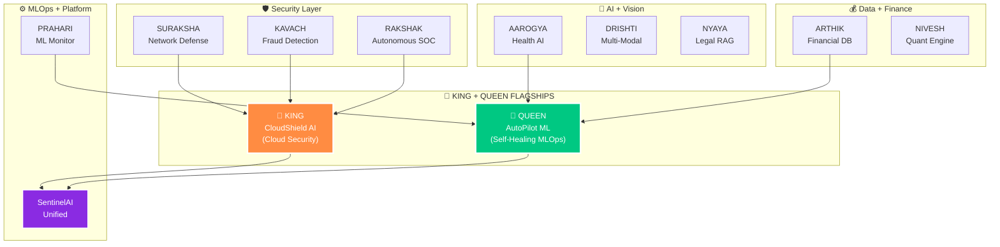

<!-- ═══════════════════════════════════════════════════════════════════
     RAINBOW GRADIENT BANNER — Capsule Render
═══════════════════════════════════════════════════════════════════ -->

<p align="center">
  
</p>

<div align="center">

> *"While others copy tutorials — I build ecosystems."*

[](https://git.io/typing-svg)

<br/>


</div>

---

## ⚡ WHO AM I

| | |
|---|---|
| 🪪 **Name** | **J. Dharun Vishnu** |
| 🎓 **Degree** | **BSc Information Technology (2023 – 2026)** |
| 🛤️ **Track** | **AI/ML Engineer → Cloud Engineer → Cybersecurity Engineer** |
| 📍 **Location** | **India 🇮🇳** |
| 🎯 **Mission** | **Build AI systems that protect India's digital infrastructure** |
| 🗺️ **Roadmap** | **8 Coursera Courses · 12 Layers · 610 Steps · 3 AWS Certifications · 20 Projects** |
| ⚡ **Currently** | **Layer 1 — Python + OOP + Streamlit + FastAPI + GitHub Actions** |
| 👑 **Flagships** | **CloudShield AI (KING) + AutoPilot ML (QUEEN) — grow with every layer** |
| 🏆 **Target 2027** | **Production AI + Cloud + Cybersecurity deployment** |

> **I'm not following a bootcamp. I'm executing a 610-step engineering roadmap — building 20 production-grade AI + security projects from scratch before I graduate.**
>
> **Every project with a v2 is a living project — it starts simple and upgrades automatically as each new layer completes. One codebase. Growing smarter with every layer.**

---

## 🚦 CURRENT STATUS — Day 22 of 610

```
ACTIVE  ►  Layer 1 — Python Foundations
           Learning: Python · OOP · APIs · Git/GitHub · Streamlit · Pytest

NEXT    ►  P1: AAROGYA v1 (First Project — Healthcare Analytics)
           Goal: Streamlit app · CI/CD · 5 Pytest tests · deployed live

GOAL    ►  Step 610 — 20 platforms deployed, job-ready engineer
```

<div align="center">

### 📊 Progress Tracker


**`Step 22 / 610 — Layer 1 in progress 🔵`**

</div>

> 🟢 **Daily Commits — Every day of learning = one commit. Watch the green squares grow.**

---

## 🛠️ BUILD PHILOSOPHY

| Principle | How |
|---|---|
| 🎯 **Real Indian use cases** | UPI fraud · RBI compliance · NSE quant · ABDM health · DPDP Act — not US examples |
| 🔄 **Living projects** | v1 → v2 → v3 → v4 — every project upgrades as new layers complete |
| 🚀 **Always deployed** | No localhost demos — every project goes live on Streamlit Cloud / AWS |
| 📦 **Open source first** | PyPI · Helm · Docusaurus — anyone can `pip install sentinelai` |
| 🧪 **5 Pytest minimum** | Every project ships with tests — no exceptions, no excuses |
| 🎬 **Demo video mandatory** | Recruiters watch demos, not READMEs. YouTube link in every repo |

---

# 🗺️ THE PLAN — 8 Courses · 12 Layers · 610 Steps · 20 Projects · 3 AWS Certs

<details>
<summary><b>📋 Click to expand full Layer Roadmap</b></summary>

<br/>

| Layer | Steps | Course | Status |
|:---:|:---:|---|:---:|
| 🔵 **Layer 1** | Step 1–85 | **🐍 PYTHON FOR EVERYBODY**<br/>University of Michigan · Python · OOP · Git · GitHub · Streamlit · pytest | 🚧 **In Progress** |
| 🟠 **Layer 2** | Step 86–140 | **🔶 DSA SPECIALIZATION**<br/>UC San Diego · Data Structures & Algorithms · LeetCode · NetworkX · Docker | 📋 Planned |
| 🟡 **Layer 3** | Step 141–180 | **🗄️ SQL FOR DATA SCIENCE**<br/>UC Davis · PostgreSQL · SQLAlchemy · Alembic · Window Functions | 📋 Planned |
| 🟢 **Layer 4+5** | Step 181–250 | **📐 MATHEMATICS FOR ML**<br/>DeepLearning.AI · NumPy · PyMC · SciPy · Bayesian Inference | 📋 Planned |
| 🟣 **Layer 6** | Step 251–325 | **🤖 ML SPECIALIZATION**<br/>Andrew Ng / DeepLearning.AI · sklearn · XGBoost · SHAP · MLflow · Optuna | 📋 Planned |
| 🩵 **Layer 7** | Step 326–340 | **☁️ AWS CLOUD PRACTITIONER**<br/>AWS · FastAPI · Docker · API Gateway | 📋 Planned |
| 🔴 **Layer 8** | Step 341–420 | **🧠 DEEP LEARNING SPECIALIZATION**<br/>Andrew Ng / DeepLearning.AI · PyTorch · EfficientNet · Transformers · ONNX | 📋 Planned |
| 🔷 **Layer 9+10** | Step 421–510 | **💬 GENAI WITH LLMs**<br/>DeepLearning.AI + AWS · LangChain · RAG · CrewAI · LangGraph | 📋 Planned |
| 🟩 **Layer 11** | Step 511–590 | **⚙️ ML ENGINEERING FOR PRODUCTION**<br/>DeepLearning.AI · MLflow · K8s · ArgoCD · Istio · Terraform | 📋 Planned |
| 🟥 **Layer 12** | Step 591–610 | **🏆 FINAL POLISH + OSS**<br/>Open Source · AWS ML Specialty · Job Ready | 📋 Planned |

</details>

<details>
<summary><b>☁️ Click to expand AWS Certification Roadmap</b></summary>

<br/>

| Layer | Certification | Status |
|:---:|---|:---:|
| 🟠 **Layer 7** | ☁️ AWS Certified Cloud Practitioner | 📋 Planned |
| 🔵 **Layer 11** | 🏗️ AWS Certified Solutions Architect Associate | 📋 Planned |
| 🟣 **Layer 12** | 🤖 AWS Certified ML Specialty | 📋 Planned |

> 🔄 Status updates as certificates are earned: `📋 Planned → 🎯 Earning → ✅ Certified`

</details>

---

# 👑 THE FLAGSHIPS — KING + QUEEN

> Two projects that grow with every single layer. By Step 610, these will be production-grade showcases built from scratch — layer by layer, skill by skill.

<details>
<summary><b>👑 KING — CloudShield AI (AI-Powered Cloud Security CSPM Platform)</b></summary>

<br/>

> AWS infrastructure auto-scanner with LLM-driven Terraform remediation.

| Version | After Layer | What's Added | Skill Proof | Status |
|:---:|:---:|---|:---:|:---:|
| **v1.0** | Layer 1 — Python | CLI tool: mocked AWS JSON scan → Streamlit report · OOP classes · pytest · GitHub Actions CI | Python OOP | 🚧 Building |
| **v1.1** | Layer 2 — DSA | Trie (IAM wildcard parsing) + Graph (lateral movement) · BFS/DFS attack path · NetworkX | DSA | 📋 Planned |
| **v1.2** | Layer 3 — SQL | PostgreSQL scan history · Window functions · SQLAlchemy ORM · Alembic migrations | SQL | 📋 Planned |
| **v1.3** | Layer 4+5 — Maths | CVSS Matrix risk scoring · NumPy · SciPy · Bayesian risk inference (PyMC) | Math + Probability | 📋 Planned |
| **v1.4** | Layer 6 — ML | Isolation Forest → CloudTrail anomaly · XGBoost threat classifier · SHAP · MLflow · Optuna | ML Production | 📋 Planned |
| **v1.5** | Layer 7 — AWS | AWS Lambda + API Gateway · FastAPI backend · Docker · Cloud Practitioner applied | AWS + Docker | 📋 Planned |
| **v1.6** | Layer 8 — DL | Autoencoder (PyTorch) → zero-day detection · EfficientNet · ONNX export | Deep Learning | 📋 Planned |
| **v1.7** | Layer 9+10 — GenAI | LLM Agent → auto Terraform fix · CrewAI multi-agent remediation · LangGraph | Agentic AI | 📋 Planned |
| **v1.8** | Layer 11 — MLOps | AWS EKS + Helm · ArgoCD GitOps · Istio mTLS · Terraform IaC · MLflow registry | ML Engineering | 📋 Planned |
| **v1.9** | Layer 12 — Final | 🏆 Enterprise-grade open-source CSPM platform · Full OSS release on PyPI | Step 610 | 📋 Planned |

</details>

<details>
<summary><b>👑 QUEEN — AutoPilot ML (Self-Healing Level-4 MLOps Platform)</b></summary>

<br/>

> Auto train · evaluate · deploy · monitor · drift detect · retrain · redeploy — designed to reach zero human intervention by Layer 12.

| Version | After Layer | What's Added | Skill Proof | Status |
|:---:|:---:|---|:---:|:---:|
| **v1.0** | Layer 1 — Python | CSV read + model metrics auto-log · OOP pipeline class · Streamlit dashboard · pytest | Python OOP | 🚧 Building |
| **v1.1** | Layer 2 — DSA | Min-Heap model ranker · LRU cache for predictions · NetworkX pipeline graph | DSA | 📋 Planned |
| **v1.2** | Layer 3 — SQL | PostgreSQL model registry + hyperparameter history · SQLAlchemy · Alembic · Window functions | SQL | 📋 Planned |
| **v1.3** | Layer 4+5 — Maths | KS Test + PSI drift detection from scratch · NumPy · SciPy · Bayesian uncertainty (PyMC) | Math + Probability | 📋 Planned |
| **v1.4** | Layer 6 — ML | Auto hyperparameter optimizer (Optuna) · XGBoost + SHAP · sklearn pipeline · MLflow | ML Production | 📋 Planned |
| **v1.5** | Layer 7 — AWS | FastAPI model serving on AWS Lambda · Docker · API Gateway · SageMaker endpoint | AWS + Docker | 📋 Planned |
| **v1.6** | Layer 8 — DL | Knowledge Distillation pipeline · PyTorch training loop · EfficientNet · ONNX export | Deep Learning | 📋 Planned |
| **v1.7** | Layer 9+10 — GenAI | LLM MLOps Copilot → drift interpret + auto-retrain · LangChain RAG · CrewAI · LangGraph | Agentic AI | 📋 Planned |
| **v1.8** | Layer 11 — MLOps | MLflow + SageMaker · canary rollout + auto rollback · ArgoCD · Istio · K8s Helm · Terraform | ML Engineering | 📋 Planned |
| **v1.9** | Layer 12 — Final | 🏆 Level-4 autonomous self-healing ML platform · Full OSS release on PyPI | Step 610 | 📋 Planned |

</details>

### 🔥 The Golden Rule

> **90% effort → 18 ecosystem projects (the foundation)**
> **10% effort → KING + QUEEN flagships (the showcase)**
> **Reuse ecosystem code in flagships. Never rewrite. Same skill — bigger impact.**

---

# 🏗️ THE ECOSYSTEM — 18 LIVING PROJECTS

> Every project is part of one unified AI + Cybersecurity command centre — **SentinelAI India.**
> None of these are tutorial clones. All connected. All upgraded layer-by-layer.

<details>
<summary><b>📋 Click to expand all 18 projects</b></summary>

<br/>

| # | Project | Layer | Status |
|:---:|---|:---:|:---:|
| **P1** | **🩺 AAROGYA v1 — INDIA HEALTH ANALYTICS**<br/>Apollo + AIIMS-style health analytics · Live deployed Streamlit app | Layer 1 | 🚧 Building |
| **P2** | **🩺 AAROGYA v2 — AI HEALTH ASSISTANT**<br/>PostgreSQL · FastAPI + ML · AWS · K8s — full Python mastery + CI/CD | L1 → L12 | 🔄 Living |
| **P3** | **🛡️ SURAKSHA v1 — NETWORK SECURITY MONITOR**<br/>BFS + DFS + Dijkstra on corporate attack paths · NetworkX | Layer 2 | 📋 Planned |
| **P4** | **🛡️ SURAKSHA v2 — THREAT INTELLIGENCE PIPELINE**<br/>Trie + Heap + HashMap + Graph · PostgreSQL · ML · AWS GuardDuty · K8s | L2 → L12 | 🔄 Living |
| **P5** | **💰 ARTHIK v1 — FINANCIAL DATABASE ENGINE**<br/>UPI / Zomato / Swiggy-style SQL analytics · Window functions · CTEs | Layer 3 | 📋 Planned |
| **P6** | **💰 ARTHIK v2 — REAL-TIME FINANCIAL PLATFORM**<br/>Apache Kafka · Redis · ML fraud detection · RBI compliance · AWS RDS | L3 → L12 | 🔄 Living |
| **P7** | **📈 NIVESH v1 — QUANTITATIVE FINANCE ENGINE**<br/>NSE portfolio · Markowitz · PCA from scratch · Pure NumPy mathematics | Layer 4 | 📋 Planned |
| **P8** | **📈 NIVESH v2 — BAYESIAN RISK PLATFORM**<br/>XGBoost + SHAP · LSTM · AWS SageMaker · MLflow drift | L4 → L12 | 🔄 Living |
| **P9** | **🔒 KAVACH v1 — FRAUD DETECTION SYSTEM**<br/>UPI fraud ML classifier · XGBoost + SHAP explainability · MLflow + Optuna | Layer 5 | 📋 Planned |
| **P10** | **🔒 KAVACH v2 — ENTERPRISE AI SECURITY**<br/>4 ML models · CNN-LSTM · SageMaker · GenAI incident summary · K8s + Feast | L5 → L12 | 🔄 Living |
| **P11** | **👁️ DRISHTI v1 — COMPUTER VISION INTELLIGENCE**<br/>EfficientNet + FaceNet + Grad-CAM + ONNX · Doctor-friendly AI with proof | Layer 7 | 📋 Planned |
| **P12** | **👁️ DRISHTI v2 — MULTI-MODAL DEEP LEARNING**<br/>4 DL architectures: Transformer + CNN-LSTM + Autoencoder + GNN ensembled | L7 → L12 | 🔄 Living |
| **P13** | **⚖️ NYAYA — INDIA LEGAL COMPLIANCE AGENT**<br/>RAG on RBI + SEBI + Companies Act 2013 · LangChain + Claude + Pinecone | L8 → L12 | 🔄 Living |
| **P14** | **🚨 RAKSHAK — AUTONOMOUS SOC PLATFORM**<br/>5 LLM agents: Triage + Investigator + Threat Intel + Responder + Reporter | L8 → L12 | 🔄 Living |
| **P15** | **📊 PRAHARI v1 — ML PRODUCTION MONITOR**<br/>MLflow + Evidently + Prometheus + Grafana · Auto-retrain on drift | Layer 10 | 📋 Planned |
| **P16** | **📊 PRAHARI v2 — CLOUD INFRASTRUCTURE PLATFORM**<br/>Multi-region K8s · ArgoCD GitOps · Istio mTLS · Chaos Engineering · Feast | L10 → L12 | 🔄 Living |
| **P17** | **🏆 SENTINELAI INDIA — UNIFIED COMMAND CENTRE**<br/>ALL 16 projects unified into ONE production platform — THE MASTERPIECE | Layer 11 | 📋 Planned |
| **P18** | **🌐 SENTINELAI INDIA OSS — OPEN SOURCE PLATFORM**<br/>Open Source launch · PyPI · Helm chart · Docusaurus docs · MIT License | Layer 11 | 📋 Planned |

</details>

---

# 🔗 ECOSYSTEM CONNECTIONS

> Every project feeds into others. By Step 610, all 20 projects form ONE unified platform.



---

## 🛠️ SKILLS — Building in Order

### ⚡ Currently Learning (Layer 1)

<p align="center">


</p>

### 🔜 Coming — Layer by Layer

<p align="center">


</p>

---

## 📊 GITHUB STATS

<div align="center">


<br/>


<br/><br/>


</div>

---

## 🌐 CONNECT

<div align="center">

[](https://linkedin.com/in/dharunvishnu)
[](https://github.com/dharunvishnu2006-ctrl)

</div>

---

<div align="center">


<br/>


</div>
