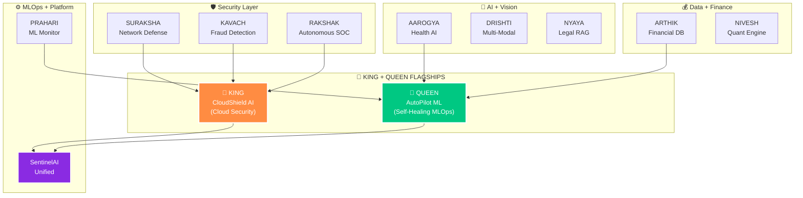

<!-- ═══════════════════════════════════════════════════════════════════
     RAINBOW GRADIENT BANNER — Capsule Render
═══════════════════════════════════════════════════════════════════ -->

<p align="center">
  
</p>

<div align="center">

> *"While others copy tutorials — I build ecosystems."*

[](https://git.io/typing-svg)

<br/>


</div>

---

## ⚡ WHO AM I

<table>
<tr><td>🪪 &nbsp;<b><font size="4">name</font></b></td><td><b><font size="4" color="#FFFFFF">J. Dharun Vishnu</font></b></td></tr>
<tr><td>🎓 &nbsp;<b><font size="4">degree</font></b></td><td><b><font size="4" color="#FFFFFF">BSc Information Technology (2023 – 2026)</font></b></td></tr>
<tr><td>🛤️ &nbsp;<b><font size="4">track</font></b></td><td><b><font size="4" color="#FFFFFF">AI/ML Engineer → Cloud Engineer → Cybersecurity Engineer</font></b></td></tr>
<tr><td>📍 &nbsp;<b><font size="4">location</font></b></td><td><b><font size="4" color="#FFFFFF">India 🇮🇳</font></b></td></tr>
<tr><td>🎯 &nbsp;<b><font size="4">mission</font></b></td><td><b><font size="4" color="#FFFFFF">Build AI systems that protect India's digital infrastructure</font></b></td></tr>
<tr><td>🗺️ &nbsp;<b><font size="4">roadmap</font></b></td><td><b><font size="4" color="#FFFFFF">8 Coursera Courses · 12 Layers · 610 Steps · 3 AWS Certifications · 20 Projects</font></b></td></tr>
<tr><td>⚡ &nbsp;<b><font size="4">currently</font></b></td><td><b><font size="4" color="#FFFFFF">Layer 1 — Python + Streamlit + FastAPI + GitHub Actions</font></b></td></tr>
<tr><td>👑 &nbsp;<b><font size="4">flagships</font></b></td><td><b><font size="4" color="#FFFFFF">CloudShield AI (KING) + AutoPilot ML (QUEEN) — grow with every layer</font></b></td></tr>
<tr><td>🏆 &nbsp;<b><font size="4">target 2027</font></b></td><td><b><font size="4" color="#FFFFFF">Production AI + Cloud + Cybersecurity deployment</font></b></td></tr>
</table>

> **I'm not following a bootcamp. I'm executing a 610-step engineering roadmap — building 20 production-grade AI + security projects from scratch before I graduate.**
>
> **Every project that has a v2 is a living project — it starts simple and upgrades automatically as each new layer (SQL → ML → DL → GenAI → AWS → MLOps) is completed. One codebase. Growing smarter with every layer.**

---

# 🗺️ THE PLAN — 8 Coursera Courses · 12 Layers · 610 Steps · 20 Projects · 3 AWS Certifications

<table>
<tr>
  <td align="center">🔵 <b>L1</b></td>
  <td><br/><sub><b><font color="#FFFFFF">University of Michigan · Python Programming · OOP · Git · GitHub · Streamlit · pytest</font></b></sub></td>
  <td align="center">📋 Planned</td>
</tr>
<tr>
  <td align="center">🟠 <b>L2</b></td>
  <td><br/><sub><b><font color="#FFFFFF">UC San Diego · Data Structures & Algorithms · LeetCode · NetworkX · Docker</font></b></sub></td>
  <td align="center">📋 Planned</td>
</tr>
<tr>
  <td align="center">🟡 <b>L3</b></td>
  <td><br/><sub><b><font color="#FFFFFF">UC Davis · PostgreSQL · SQLAlchemy · Alembic · Window Functions</font></b></sub></td>
  <td align="center">📋 Planned</td>
</tr>
<tr>
  <td align="center">🟢 <b>L4+5</b></td>
  <td><br/><sub><b><font color="#FFFFFF">DeepLearning.AI · NumPy · PyMC · SciPy · Bayesian Inference</font></b></sub></td>
  <td align="center">📋 Planned</td>
</tr>
<tr>
  <td align="center">🟣 <b>L6</b></td>
  <td><br/><sub><b><font color="#FFFFFF">Andrew Ng / DeepLearning.AI · sklearn · XGBoost · SHAP · MLflow · Optuna</font></b></sub></td>
  <td align="center">📋 Planned</td>
</tr>
<tr>
  <td align="center">🩵 <b>L7</b></td>
  <td><br/><sub><b><font color="#FFFFFF">AWS · FastAPI · Docker · API + Tools + AWS Cloud Practitioner</font></b></sub></td>
  <td align="center">📋 Planned</td>
</tr>
<tr>
  <td align="center">🔴 <b>L8</b></td>
  <td><br/><sub><b><font color="#FFFFFF">Andrew Ng / DeepLearning.AI · PyTorch · EfficientNet · Transformers · ONNX</font></b></sub></td>
  <td align="center">📋 Planned</td>
</tr>
<tr>
  <td align="center">🔷 <b>L9+10</b></td>
  <td><br/><sub><b><font color="#FFFFFF">DeepLearning.AI + AWS · LangChain · RAG · CrewAI · LangGraph</font></b></sub></td>
  <td align="center">📋 Planned</td>
</tr>
<tr>
  <td align="center">🟩 <b>L11</b></td>
  <td><br/><sub><b><font color="#FFFFFF">DeepLearning.AI · MLflow · K8s · ArgoCD · Istio · Terraform</font></b></sub></td>
  <td align="center">📋 Planned</td>
</tr>
<tr>
  <td align="center">🟥 <b>L12</b></td>
  <td><br/><sub><b><font color="#FFFFFF">Final Polish · Open Source · AWS ML Specialty · Job Ready</font></b></sub></td>
  <td align="center">📋 Planned</td>
</tr>
</table>

### ☁️ AWS Certifications

<table>
<tr>
  <td align="center">🟠 <b>L7</b></td>
  <td></td>
  <td align="center">📋 Planned</td>
</tr>
<tr>
  <td align="center">🔵 <b>L11</b></td>
  <td></td>
  <td align="center">📋 Planned</td>
</tr>
<tr>
  <td align="center">🟣 <b>L12</b></td>
  <td></td>
  <td align="center">📋 Planned</td>
</tr>
</table>

> 🔄 Status updates as certificates are earned: `📋 Planned` → `🎯 Earning` → `✅ Certified`

---

# 👑 THE FLAGSHIPS — 2 KING-QUEEN PROJECTS

> **Two enterprise-grade projects that grow with every single layer. By Step 610, these will be world-class showcases built from scratch.**

<br/>

## 👑 KING PROJECT — CloudShield AI

<p align="center">

</p>

**🛡️ AI-Powered Cloud Security Posture Management (CSPM) Platform**

> AWS infrastructure auto-scanner with LLM-driven Terraform remediation.

### 📈 Layer-by-Layer Upgrade Journey

| Version | After Layer | What's Added | Skill Proof |
|:-------:|:-----------:|--------------|:-----------:|
| **v1.0** | L1 Python    | CLI tool: mocked AWS JSON scan → Streamlit report  | <b><font color="#FFFFFF">Python OOP</font></b> |
| **v1.1** | L2 DSA       | Trie (IAM wildcard parsing) + Graph (lateral movement) | <b><font color="#FFFFFF">Data Structures</font></b> |
| **v1.2** | L3 SQL       | PostgreSQL scan history + Window functions (trends) | <b><font color="#FFFFFF">SQL Mastery</font></b> |
| **v1.3** | L4 Maths     | CVSS Matrix risk scoring (linear algebra from scratch) | <b><font color="#FFFFFF">Math Foundation</font></b> |
| **v1.4** | L5 ML        | Isolation Forest → CloudTrail anomaly detection | <b><font color="#FFFFFF">ML Production</font></b> |
| **v1.5** | L7 DL        | Autoencoder → network traffic zero-day detection | <b><font color="#FFFFFF">Deep Learning</font></b> |
| **v1.6** | L8 GenAI     | LLM Agent (LangChain + RAG) → auto Terraform fix | <b><font color="#FFFFFF">Agentic AI</font></b> |
| **v1.7** | L10 MLOps    | AWS EKS + Helm Chart + PyPI package publish | <b><font color="#FFFFFF">Production Scale</font></b> |
| **v1.8** | L11 Final    | **Enterprise-grade open-source CSPM platform** 🏆 | <b><font color="#FFFFFF">Step 610</font></b> |

---

## 👑 QUEEN PROJECT — AutoPilot ML

<p align="center">

</p>

**🤖 Self-Healing Level-4 MLOps Platform**

> Auto train · evaluate · deploy · monitor · drift detect · retrain · redeploy — zero human intervention.

### 📈 Layer-by-Layer Upgrade Journey

| Version | After Layer | What's Added | Skill Proof |
|:-------:|:-----------:|--------------|:-----------:|
| **v1.0** | L1 Python    | CSV read + model metrics auto-log | <b><font color="#FFFFFF">Python OOP</font></b> |
| **v1.1** | L2 DSA       | Min-Heap model ranker (latency + accuracy score) | <b><font color="#FFFFFF">Data Structures</font></b> |
| **v1.2** | L3 SQL       | PostgreSQL model registry + hyperparameter history | <b><font color="#FFFFFF">SQL Mastery</font></b> |
| **v1.3** | L4 Maths     | KS Test + PSI drift detection from scratch | <b><font color="#FFFFFF">Math Foundation</font></b> |
| **v1.4** | L5 ML        | Auto hyperparameter optimizer (Optuna-style) | <b><font color="#FFFFFF">ML Production</font></b> |
| **v1.5** | L7 DL        | Knowledge Distillation pipeline (large → small model) | <b><font color="#FFFFFF">Deep Learning</font></b> |
| **v1.6** | L8 GenAI     | LLM MLOps Copilot → drift interpret + auto-trigger | <b><font color="#FFFFFF">Agentic AI</font></b> |
| **v1.7** | L10 MLOps    | MLflow + SageMaker + canary rollout + auto rollback | <b><font color="#FFFFFF">Production Scale</font></b> |
| **v1.8** | L11 Final    | **Level-4 autonomous self-healing ML platform** 🏆 | <b><font color="#FFFFFF">Step 610</font></b> |

---

### 🔥 The Golden Rule

> **<font color="#FFFFFF">90% effort → 18 ecosystem projects (the foundation)</font>**
> **<font color="#FFFFFF">10% effort → KING + QUEEN flagships (the showcase)</font>**
> **<font color="#FFFFFF">Reuse ecosystem code in flagships. Never rewrite. Same skill — bigger impact.</font>**

---

# 🏗️ THE ECOSYSTEM — 18 LIVING PROJECTS

> **<font color="#FFFFFF">Every project is part of one unified AI + Cybersecurity command centre — SentinelAI India.</font>**
> **<font color="#FFFFFF">None of these are tutorial clones. All connected. All upgraded layer-by-layer.</font>**
>
> **<font color="#FFFFFF">v1 projects = built in the assigned layer · v2 projects = 🔄 living projects that upgrade automatically as each new layer is completed.</font>**

<br/>

<table>
<tr><th>#</th><th>Project</th><th>Layer</th><th>Status</th></tr>

<tr>
  <td align="center"><b>P1</b></td>
  <td>
    <br/>
    <sub><b><font color="#FFFFFF">Apollo + AIIMS-style health analytics · Live deployed Streamlit app</font></b></sub>
  </td>
  <td align="center">L1</td>
  <td align="center">📋 Planned</td>
</tr>

<tr>
  <td align="center"><b>P2</b></td>
  <td>
    <br/>
    <sub><b><font color="#FFFFFF">PostgreSQL · FastAPI + ML · AWS · K8s — full Python mastery + CI/CD</font></b></sub>
  </td>
  <td align="center">L1 → ∞</td>
  <td align="center">🔄 Living</td>
</tr>

<tr>
  <td align="center"><b>P3</b></td>
  <td>
    <br/>
    <sub><b><font color="#FFFFFF">BFS + DFS + Dijkstra on corporate attack paths · NetworkX</font></b></sub>
  </td>
  <td align="center">L2</td>
  <td align="center">📋 Planned</td>
</tr>

<tr>
  <td align="center"><b>P4</b></td>
  <td>
    <br/>
    <sub><b><font color="#FFFFFF">Trie + Heap + HashMap + Graph · PostgreSQL · ML · AWS GuardDuty · K8s</font></b></sub>
  </td>
  <td align="center">L2 → ∞</td>
  <td align="center">🔄 Living</td>
</tr>

<tr>
  <td align="center"><b>P5</b></td>
  <td>
    <br/>
    <sub><b><font color="#FFFFFF">UPI / Zomato / Swiggy-style SQL analytics · Window functions · CTEs</font></b></sub>
  </td>
  <td align="center">L3</td>
  <td align="center">📋 Planned</td>
</tr>

<tr>
  <td align="center"><b>P6</b></td>
  <td>
    <br/>
    <sub><b><font color="#FFFFFF">FastAPI + ML · AWS RDS Multi-AZ · GenAI · K8s + Vault — RBI compliance</font></b></sub>
  </td>
  <td align="center">L3 → ∞</td>
  <td align="center">🔄 Living</td>
</tr>

<tr>
  <td align="center"><b>P7</b></td>
  <td>
    <br/>
    <sub><b><font color="#FFFFFF">NSE portfolio · Markowitz · PCA from scratch · Pure NumPy mathematics</font></b></sub>
  </td>
  <td align="center">L4</td>
  <td align="center">📋 Planned</td>
</tr>

<tr>
  <td align="center"><b>P8</b></td>
  <td>
    <br/>
    <sub><b><font color="#FFFFFF">XGBoost + SHAP · LSTM · AWS SageMaker · MLflow drift — Goldman-level</font></b></sub>
  </td>
  <td align="center">L4 → ∞</td>
  <td align="center">🔄 Living</td>
</tr>

<tr>
  <td align="center"><b>P9</b></td>
  <td>
    <br/>
    <sub><b><font color="#FFFFFF">UPI fraud ML classifier · XGBoost + SHAP explainability · MLflow + Optuna</font></b></sub>
  </td>
  <td align="center">L5</td>
  <td align="center">📋 Planned</td>
</tr>

<tr>
  <td align="center"><b>P10</b></td>
  <td>
    <br/>
    <sub><b><font color="#FFFFFF">4 ML models · CNN-LSTM · SageMaker · GenAI incident summary · K8s + Feast</font></b></sub>
  </td>
  <td align="center">L5 → ∞</td>
  <td align="center">🔄 Living</td>
</tr>

<tr>
  <td align="center"><b>P11</b></td>
  <td>
    <br/>
    <sub><b><font color="#FFFFFF">EfficientNet + FaceNet + Grad-CAM + ONNX · Doctor-friendly AI with proof</font></b></sub>
  </td>
  <td align="center">L7</td>
  <td align="center">📋 Planned</td>
</tr>

<tr>
  <td align="center"><b>P12</b></td>
  <td>
    <br/>
    <sub><b><font color="#FFFFFF">4 DL architectures: Transformer + CNN-LSTM + Autoencoder + GNN ensembled</font></b></sub>
  </td>
  <td align="center">L7 → ∞</td>
  <td align="center">🔄 Living</td>
</tr>

<tr>
  <td align="center"><b>P13</b></td>
  <td>
    <br/>
    <sub><b><font color="#FFFFFF">RAG on RBI + SEBI + Companies Act 2013 · LangChain + Claude + Pinecone</font></b></sub>
  </td>
  <td align="center">L8 → ∞</td>
  <td align="center">🔄 Living</td>
</tr>

<tr>
  <td align="center"><b>P14</b></td>
  <td>
    <br/>
    <sub><b><font color="#FFFFFF">5 LLM agents: Triage + Investigator + Threat Intel + Responder + Reporter</font></b></sub>
  </td>
  <td align="center">L8 → ∞</td>
  <td align="center">🔄 Living</td>
</tr>

<tr>
  <td align="center"><b>P15</b></td>
  <td>
    <br/>
    <sub><b><font color="#FFFFFF">MLflow + Evidently + Prometheus + Grafana · Auto-retrain on drift</font></b></sub>
  </td>
  <td align="center">L10</td>
  <td align="center">📋 Planned</td>
</tr>

<tr>
  <td align="center"><b>P16</b></td>
  <td>
    <br/>
    <sub><b><font color="#FFFFFF">Multi-region K8s · ArgoCD GitOps · Istio mTLS · Chaos Engineering · Feast</font></b></sub>
  </td>
  <td align="center">L10 → ∞</td>
  <td align="center">🔄 Living</td>
</tr>

<tr>
  <td align="center"><b>P17</b></td>
  <td>
    <br/>
    <sub><b><font color="#FFFFFF">ALL 16 projects unified into ONE production platform — THE MASTERPIECE</font></b></sub>
  </td>
  <td align="center">L11</td>
  <td align="center">📋 Planned</td>
</tr>

<tr>
  <td align="center"><b>P18</b></td>
  <td>
    <br/>
    <sub><b><font color="#FFFFFF">Open Source launch · PyPI · Helm chart · Docusaurus docs · MIT License</font></b></sub>
  </td>
  <td align="center">L11</td>
  <td align="center">📋 Planned</td>
</tr>

</table>

---

# 🔗 ECOSYSTEM CONNECTIONS

> **<font color="#FFFFFF">Every project feeds into others. By Step 610, all 20 projects form ONE unified platform.</font>**



---

## 📍 CURRENT STATUS

```
TODAY  ►  Layer 1 — Python Foundations
          Learning: Python · OOP · APIs · GitHub · Streamlit · Pytest

NEXT   ►  P1: AAROGYA v1 (First Project)
          Goal: Healthcare platform with CI/CD + 5 Pytest tests
          Bonus: KING v1.0 CLI + QUEEN v1.0 metric logger

GOAL   ►  Step 610 — 20 platforms deployed, job-ready engineer
```

<div align="center">

### 📊 Progress Tracker


</div>

> 🟢 **Daily Commits** — Every day of learning = one commit. Watch the green squares grow.

---

## 🛠️ SKILLS — Building in Order

### ⚡ Currently Learning (Layer 1)

<p align="center">


</p>

### 🔜 Coming — Layer by Layer

<p align="center">


</p>

---

## 📊 GITHUB STATS

<div align="center">


<br/>


<br/><br/>


</div>

---

## 💡 BUILD PHILOSOPHY

> **<font color="#FFFFFF">Small steps. One layer at a time. No rushing. No skipping foundations. Execution > hype.</font>**

<table>
<tr>
  <td><b>🎯 Real Indian use cases</b></td>
  <td><b><font color="#FFFFFF">UPI fraud, RBI compliance, NSE quant, ABDM health, DPDP Act — not US examples</font></b></td>
</tr>
<tr>
  <td><b>🔄 Living projects</b></td>
  <td><b><font color="#FFFFFF">v1 → v2 → v3 → v4 — every project upgrades as new layers complete</font></b></td>
</tr>
<tr>
  <td><b>🚀 Always deployed</b></td>
  <td><b><font color="#FFFFFF">No localhost demos — every project goes live on Streamlit Cloud / AWS</font></b></td>
</tr>
<tr>
  <td><b>📦 Open source first</b></td>
  <td><b><font color="#FFFFFF">PyPI · Helm · Docusaurus — anyone can <code>pip install sentinelai</code></font></b></td>
</tr>
<tr>
  <td><b>🧪 5 Pytest minimum</b></td>
  <td><b><font color="#FFFFFF">Every project ships with tests — no exceptions, no excuses</font></b></td>
</tr>
<tr>
  <td><b>🎬 Demo video mandatory</b></td>
  <td><b><font color="#FFFFFF">Recruiters watch demos, not READMEs. YouTube link in every repo</font></b></td>
</tr>
</table>

---

## 🌐 CONNECT

<div align="center">

[](https://linkedin.com/in/dharunvishnu)
[](https://github.com/dharunvishnu2006-ctrl)

</div>

---

<div align="center">


<br/>


</div>
